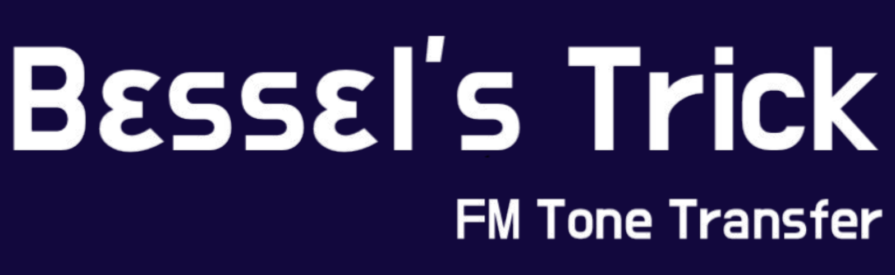
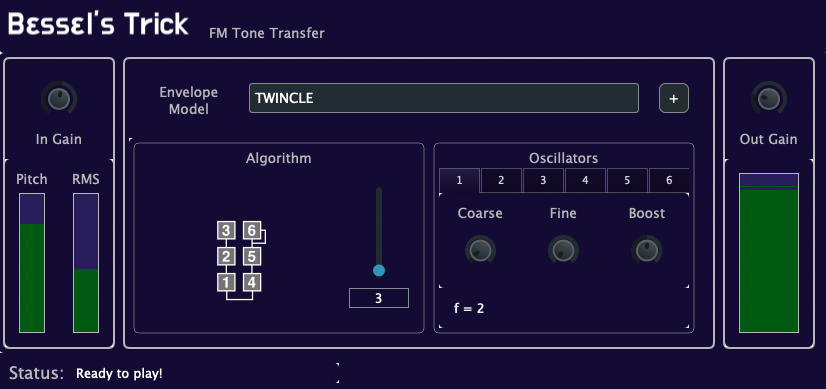
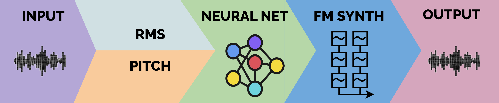

<center>

</center>

**Bessel's Trick** is a `Neural Audio Plugin` for **fast, live** Tone Transformation of Musical Instrument sounds using [Frequency Modulation](https://en.wikipedia.org/wiki/Frequency_modulation_synthesis) (FM) synthesis.

[](https://GitHub.com/fcaspe/BesselsTrick/releases/)


### Features:
 - FM Synth controllable from an Audio Input.
    - Try feedng it voice, violin, solo guitar, trumpet.
 - Designed for live playing.
    - Fast sound generation, *1.3ms inference latency*
 - 6-oscillator FM engine.
    - Based on the classic Yamaha DX7.
 - Comes with many pretrained sounds!
    - See the Release webpage.
 - Tweakable FM controls on real time.
 - VST3 and AU plugin formats available.

&nbsp;
<center>


</center>
<center>Plugin GUI</center>

## Build it

Clone this repository and run:

```bash
source build.sh
```

This will run the build and install process.

## Bringing in more sounds

Bringing more sounds require obtaining an FM patch in DX7 format and then training a new model. For info on how to train new models visit the [Envelope Learning](https://github.com/fcaspe/fmtransfer) repository.

## How does it work?

<center>

</center>

Bessel's Trick does not use MIDI to control the synth. Instead, it works in an `audio to audio` fashion, similar to other [Tone Transfer](https://sites.research.google/tonetransfer) approaches.

The plugin extracts continuous sequences of pitch and RMS from a `monophonic` audio signal, and uses small neural nets (one for each sound) to map these to the envelopes of a six-oscillator FM synth.

But, unlike previous approaches, I use a different method for training the neural nets, that addresses the poor articulation present in previous methods. If you want to learn more check out my [Envelope Learning](https://fcaspe.github.io/fmtransfer) paper.

### Why FM?

Frequency Modulation synthesis is a versatile and compact approach for synthesizing a wide range of timbres. Moreover, there is a wide variety of sounds already designed, particularly in the form of **Yamaha DX7** Patches.

[Envelope Learning](https://fcaspe.github.io/fmtransfer) learns to control envelopes of synthesizer models. We use **Yamaha DX7** patches to train the neural nets.

### Why Neural Nets?

Each sound is implemented with a really tiny Recurrent Neural Network (RNN) that has been trained to replicate the oscillators' amplitude envelopes from a `continuous control` signals. Players have continuous influence on the sound throughout the playing action.

This continuous control enables some cool articulations for free! For instance, on a guitar, Bessel's Trick can support String Muting, Hammer-on, Pull-off, and Natural harmonics.

Try it with other *monophonic* instruments!

## Acknowledgements

I would like to thank these lovely folks for their time!
 - Jeff Miller (GUI design tips)
 - Rodrigo Diaz (Building Pipeline, Apple Notarization)
 - Daniel Walz (PGM library tips)

## Licenses
 - Bessel's Trick released under BSD-3.
 - Foleys GUI Magic Library licensed under BSD-3.
 - YIN Pitch Tracker adapted from [Pidato](https://github.com/JorenSix/Pidato), licensed under GNU GPL 3.

 ## Citation
 If you find this work useful, please consider citing us:

```bibtex
@article{caspe2023learnedenvelopes,
    title={{FM Tone Transfer with Learned Envelopes}},
    author={Caspe, Franco and McPherson, Andrew and Sandler, Mark},
    journal={Proceedings of Audio Mostly 2023},
    year={2023}
}
```